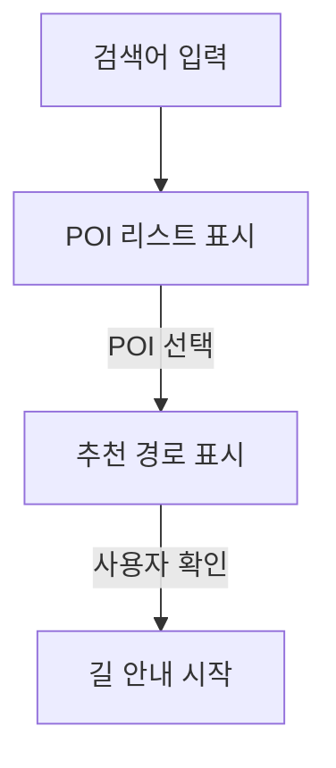

# AVOID

HUDuck팀의 애플리케이션, 
AVOID를 찾아주셔서 감사합니다.

본 애플리케이션은 총 4개의 기능으로 이뤄져 있습니다.
 1. [내비게이션](#내비게이션)
 2. [내 차 설정](#내-차-설정)
 3. [디바이스 연결](#디바이스-연결)
 4. [HUD 표시 항목 설정](#hud-표시-항목-설정)

## 내비게이션

검색을 통해 원하는 장소를 찾을 수 있습니다.
그 후, 사용자의 화물차 정보를 기반으로 경로를 추천 및 안내합니다. 

### 흐름도

###### powered by [NAVER](https://www.naver.com), [TMAP](https://www.tmap.co.kr)
 

## 내 차 설정

다양한 기능에 기반이 되는 사용자의 화물차 정보를 입력할 수 있습니다.

## 디바이스 연결

블루투스를 통해 HUD 디바이스와 스마트폰의 연결을 돕습니다.

## HUD 표시 항목 설정

사용자가 HUD 디바이스에 표시하고자 하는 항목을 지정할 수 있습니다.
