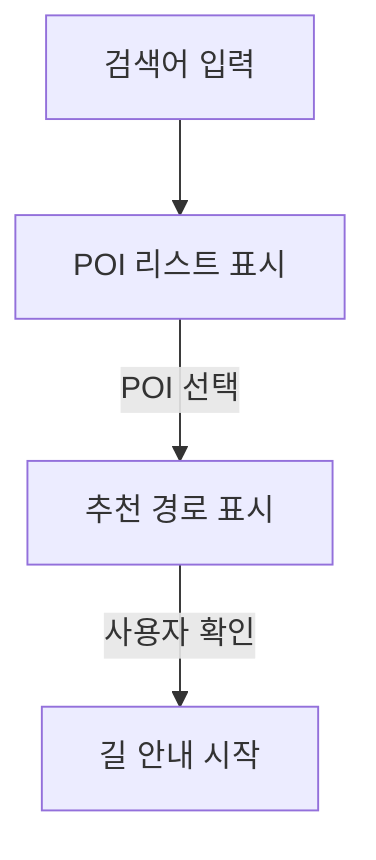

# 1. AVOID

HUDuck팀의 애플리케이션, **AVOID**입니다.

# 2. 시작

## 2.1. 개발 환경

PC OS `macOS Big Sur 11.4 (Apple M1)`<br/>
Android Studio `Arctic Fox | 2020.3.1 Beta 3 (aarch64)`<br/>
Android Emulator `Pixel 2 API 30 (Android 11.0, arm64)`<br/>
Android Gradle Plugin Version `7.0.0-beta03`<br/>
Gradle Version `7.0`

## 2.2. API (SDK)

애플리케이션의 구현을 위해 사용된 API 목록입니다.

[NAVER MAPS API]()<br/>
[T map API]()<br/>
[Mapbox Navigation SDK]()

## 2.3. API Key 설정

위에 열거된 API를 사용하기 위해, 반드시 API Key를 입력해야 합니다.

API Key 발급 방법은 API Document를 참고하시면 됩니다.

### 2.3.1. NAVER MAPS API

[NAVER MAPS API Document](https://navermaps.github.io/android-map-sdk/guide-ko/0.html)

`res/values/api_keys.xml` 파일 내부에 클라이언트 ID를 입력합니다.
```xml
<string name="naver_maps_client_id">클라이언트 ID</string>
```

### 2.3.2. T map API

[T map API Document](https://tmapapi.sktelecom.com/main.html#android/guide/androidGuide.sample1)

`res/values/api_keys.xml` 파일 내부에 API Key를 입력합니다.
```xml
<string name="skt_map_api_key">API Key</string>
```

### 2.3.3. Mapbox Navigation SDK

[Mapbox Navigation SDK Document](https://docs.mapbox.com/android/navigation/guides/)

`res/values/api_keys.xml` 파일 내부에 엑세스 토큰을 입력합니다.
```xml
<string name="mapbox_access_token">엑세스 토큰</string>
```

`gradle.properties` 파일 내부에 다운로드 토큰을 입력합니다.
```gradle
MAPBOX_DOWNLOADS_TOKEN=다운로드 토큰
```


# 3. 기능

본 애플리케이션은 총 4개의 기능으로 이뤄져 있습니다.
 1. 내비게이션
 2. 내 차 설정
 3. 디바이스 연결
 4. HUD 표시 항목 설정

## 3.1. 내비게이션

검색을 통해 원하는 장소를 찾을 수 있습니다.
그 후, 사용자의 화물차 정보를 기반으로 경로를 추천 및 안내합니다. 

### 3.1.1. 흐름도



### 3.1.2. GPS 테스트 방법

아래에 링크된 GPS 센서값 변경 애플리케이션을 통해, 애뮬레이터로 GPS 테스트를 쉽게 하실 수 있습니다.

[Fake GPS Location - GPS JoyStick](https://play.google.com/store/apps/details?id=com.theappninjas.fakegpsjoystick&hl=ko&gl=US)


## 3.2. 내 차 설정

다양한 기능에 기반이 되는 사용자의 화물차 정보를 입력할 수 있습니다.

## 3.3. 디바이스 연결

블루투스를 통해 HUD 디바이스와 스마트폰의 연결을 돕습니다.

## 3.4. HUD 표시 항목 설정

사용자가 HUD 디바이스에 표시하고자 하는 항목을 지정할 수 있습니다.
